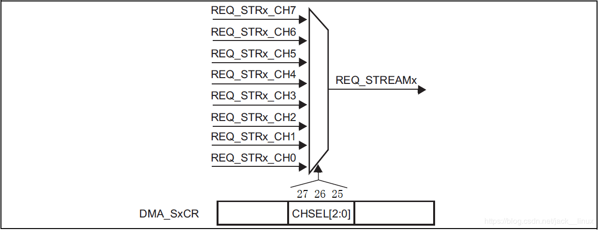
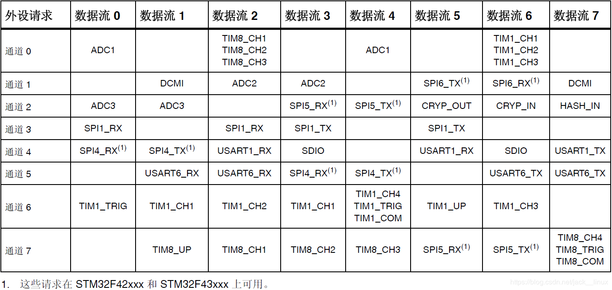

# Serial port DMA mode sending & receiving
The author is using STM32F407VET6, which contains a total of 6 serial ports. The program at the end of the page has completed the DMA transceiver configuration of all serial ports. This article only uses serial port 1 as an example to explain.

This project is a register version, but it can still be added and used in library functions.

Use resources:
| Model  | DMA               | I/O       |
| ------ |:-----------------:|:---------:|
| USART1 | DMA2_7_CH4 (USART1_TX)<br>DMA2_5_CH4 (USART1_RX) | PA9<br>PA10  |
| USART2 | DMA1_6_CH4 (USART2_TX)<br>DMA1_5_CH4 (USART2_RX) | PA2<br>PA3   |
| USART3 | DMA1_3_CH4 (USART3_TX)<br>DMA1_1_CH4 (USART3_RX) | PB10<br>PB11 |
| UART4  | DMA1_4_CH4 (USART4_TX)<br>DMA1_2_CH4 (USART4_RX) | PA0<br>PA1   |
| UART5  | DMA1_7_CH4 (USART5_TX)<br>DMA1_0_CH4 (USART5_RX) | PC12<br>PD2  |
| USART6 | DMA2_6_CH5 (USART6_TX)<br>DMA2_1_CH5 (USART6_RX) | PC6<br>PC7   |

[Interrupt]: 6 serial port idle reception interrupts, 6 DMA reception completion interrupts (12 in total, set to group 2, priority (3,3)~(1,0))

## 1 STM32F4 DMA Introduction  
DMA, full name: Direct Memory Access, that is, direct memory access. The DMA transfer method does not require the CPU to directly control the transmission, and there is no process of retaining and restoring the scene like the interrupt processing method. The hardware opens a direct transmission path for RAM and I/O devices, which can greatly improve the efficiency of the CPU.  
STM32F4 has up to 2 DMA controllers (DMA1 and DMA2), with a total of 16 data streams (8 per controller). Each DMA controller is used to manage memory access requests of one or more peripherals. Each data stream can have up to 8 channels (or requests) in total. Each data flow channel has an arbiter that handles priority among DMA requests.  

It can handle the following transactions:

1. Peripheral to memory transfer
2. Transfer from memory to peripherals
3. Storage-to-storage transfer

> [Note]: The DMA1 controller AHB peripheral port is different from the DMA2 controller and is not connected to the bus matrix. Therefore, only the DMA2 data flow can perform memory to  

memory transfer.

Among them, the multi-channel selection of data streams is controlled through the DMA_SxCR register, as shown in Figure 1:

<p align="center"></p>
<p align="center" style="color:orange; font-size:14px; color: #999; " >Figure 1 Channel selection</p>

As can be seen from the above figure, DMA_SxCR controls which channel the data stream uses. Each data stream has 8 channels to choose from, but only one channel can be selected for DMA transmission at a time. The channel mapping table of each data stream of DMA2 is, As shown in Table 1

<p align="center"></p>
<p align="center" style="color:orange; font-size:14px; color: #999; " >1 DMA2 data flow mapping table</p>

The above table lists all possible selections of DMA2, with a total of 64 combinations. For example, in this chapter, if we want to implement DMA transmission of serial port 1, that is, USART1_TX, we must select data stream 7 and channel 4 of DMA2 for DMA transmission. Note here that some peripherals (such as USART1_RX) may have multiple channels to choose from, just choose one at will.

## Introduction to important registers

**(1) DMA interrupt status register**

There are a total of 2 registers: DMA_LISR and DMA_HISR. Each register manages 4 data streams (8 in total). The DMA_LISR register is used to manage data streams 0~3, while DMA_HISR is used to manage data streams 4~7. If the interrupt corresponding to these bits in DMA_LISR is enabled, it will jump to the interrupt service function after the condition is met. Even if it is not enabled, the current DMA transfer status can be obtained by querying these bits. What is commonly used here is the TCIFx bit, which is the DMA transfer completion flag of data stream x.

> [Note]: This register is a read-only register, so after these bits are set, they can only be cleared through [Interrupt Flag Clear Register].

**(2) DMA interrupt flag clear register**  

There are also 2 registers: DMA_LIFCR and DMA_HIFCR. Each register also controls 4 data streams. This register is a write-only register, and its bits are used to clear the corresponding bits of the [Interrupt Status Register]. They are cleared by writing 1.

**(3) DMA data stream x configuration register (DMA_SxCR)**

 This register controls a lot of DMA related information, including data width, peripheral and memory width, priority, incremental mode, transfer direction, interrupt enable, enable, etc., which are all set through this register. So DMA_ SxCR is the core control register of DMA transfer.
 
**(4) DMA data stream x data item number register (DMA_SxNDTR)**
 
 This register controls the amount of data to be transferred for each transfer of DMA data stream x. Its setting range is 0~65535. And the value of this register will decrease as the transmission progresses. When the value of this register is 0, it means that all the data transmission has been completed. Therefore, the progress of the current DMA transfer can be known through the value of this register.
 
 > [Note]: This is the number of data items, not the number of bytes. For example, if the data bit width is set to 16 bits, then one transmission (one item) is 2 bytes

**(5)Peripheral address register (DMA_SxPAR) of DMA data stream x**

This register is used to store the address of the STM32F4 peripheral. For example, if serial port 1 is used, then this register must be written with 0x40011004 (actually &USART1_DR).

**(6) Memory address register of DMA data stream x**

Since the DMA of STM32F4 supports double buffering, there are two memory address registers: DMA_SxM0AR and DMA_SxM1AR, among which DMA_SxM1AR is only valid in double buffering mode. For example, if you use the USART1_TX_BUF[USART_LEN] array as memory, then write &USART1_TX_BUF in DMA_SxM0AR.

## 2 Transceiver configuration

### 2.1 Serial port configuration (enable DMA transceiver)

Key points: Enable the reception and transmission of serial port 1 and the DMA reception and transmission of serial port 1 and enable the idle interrupt of serial port 1

```
/*------------------------------------------------  
* Function name: void Init_USART1(u32 pclk2,u32 bound)  
* Function: Initialize IO serial port 1  
* Parameter: pclk2: PCLK2 clock frequency (Mhz)  
	      bound: baud rate   
* Return value: None  
------------------------------------------------*/  
void Init_USART1(u32 pclk2,u32 bound)  
{  	   
	float temp;  
	u16 mantissa;  
	u16 fraction;	     
	temp=(float)(pclk2*1000000)/(bound*16);//get USARTDIV@OVER8=0  
	mantissa=temp; //Get the integer part  
	fraction=(temp-mantissa)*16; //Get the decimal part @OVER8=0   
        mantissa<<=4;  
	mantissa+=fraction;   
	RCC->AHB1ENR|=1<<0; //Enable PORTA port clock    
	RCC->APB2ENR|=1<<4; //Enable serial port 1 clock   
	GPIO_Set(GPIOA,PIN9|PIN10,GPIO_MODE_AF,GPIO_OTYPE_PP,GPIO_SPEED_50M,GPIO_PUPD_PU);//PA9,PA10, multiplex function, pull-up output  
 	GPIO_AF_Set(GPIOA,9,7);	//PA9,AF7  
	GPIO_AF_Set(GPIOA,10,7);//PA10,AF7  	     
	//Baud rate setting  
 	USART1->BRR=mantissa; //Baud rate setting	   
	USART1->CR1&=~(1<<15); //Set OVER8=0   
	  
	USART1->CR1|=1<<3; //Serial port transmission enable   
	USART1->CR3|=1<<7; //Enable DMA transmission of serial port 1  
	   
#if EN_USART1_RX //If reception is enabled  	
	USART1->CR1|=1<<2; //Serial port reception enable  
	USART1->CR3|=1<<6; //Enable DMA reception of serial port 1    
	USART1->CR1|=1<<4; //Enable idle interrupt  	    	
	MY_NVIC_Init(3,3,USART1_IRQn,2);//Group 2, lowest priority   
#endif  
	USART1->CR1|=1<<13; //Serial port enable  
}  
```

### 2.2 Two variables

The data sent and received will be stored in the following two variables.

```
#define USART_LEN 50 //Define the maximum number of bytes received 50  
u8 USART1_TX_BUF[USART_LEN];  
u8 USART1_RX_BUF[USART_LEN];  
```  
### 2.3 DMA configuration

(1) Enable the DMA2 clock and wait for the data stream to be configurable.

(2) Set peripheral address

(3) Set the memory address

(4) Set the amount of data to be transmitted

(5) Set the configuration information of data flow 7

(6) Turn on the transmission completion interrupt of data stream 7

```
/*------------------------------------------------  
* 函数名：void MYDMA_Config(DMA_Stream_TypeDef *DMA_Streamx,u8 chx,u32 par,u32 mar,u16 ndtr,u8 dir)  
* Function: configure DMA  
* Parameter: DMA_Streamx: DMA data stream (DMA1_Stream0~7/DMA2_Stream0~7)  
	     chx: DMA channel selection (range: 0~7)  
	     par: peripheral address  
		 mar: memory address  
		 ndtr: data transfer volume  
		 dir: Data transfer direction (DMA_DIR_PeripheralToMemory / DMA_DIR_MemoryToPeripheral / DMA_DIR_MemoryToMemory)  
* Return value: None  
------------------------------------------------*/  
void MYDMA_Config(DMA_Stream_TypeDef *DMA_Streamx,u8 chx,u32 par,u32 mar,u16 ndtr,u8 dir)  
{   
	DMA_TypeDef *DMAx;  
	u8 streamx;  
	if((u32)DMA_Streamx>(u32)DMA2)//Get whether the current stream belongs to DMA2 or DMA1  
	{  
		DMAx=DMA2;  
		RCC->AHB1ENR|=1<<22;//DMA2 clock enable     
	}else   
	{  
		DMAx=DMA1;   
 		RCC->AHB1ENR|=1<<21;//DMA1 clock enable   
	}  
	while(DMA_Streamx->CR&0X01);//Waiting for DMA to be configured   
	streamx=(((u32)DMA_Streamx-(u32)DMAx)-0X10)/0X18; //Get the stream channel number  
 	if(streamx>=6)DMAx->HIFCR|=0X3D<<(6*(streamx-6)+16); //Clear all previous interrupt flags on the stream  
	else if(streamx>=4)DMAx->HIFCR|=0X3D<<6*(streamx-4); //Clear all previous interrupt flags on the stream  
	else if(streamx>=2)DMAx->LIFCR|=0X3D<<(6*(streamx-2)+16);//Clear all previous interrupt flags on the stream  
	else DMAx->LIFCR|=0X3D<<6*streamx; //Clear all previous interrupt flags on the stream  
	    
	DMA_Streamx->PAR=par; //DMA peripheral address      
	DMA_Streamx->M0AR=mar; //DMA memory 0 address        
	DMA_Streamx->NDTR=ndtr; //n data items  
	DMA_Streamx->CR=0; //Reset all CR register values ​​first   
   
	switch(dir)  
	{    
		case DMA_DIR_PeripheralToMemory: //Peripheral to memory mode  
			DMA_Streamx->CR&=~(1<<6);  
			DMA_Streamx->CR&=~(1<<7);    
			break;      
		case DMA_DIR_MemoryToPeripheral:         
			DMA_Streamx->CR|=1<<6;          
			DMA_Streamx->CR&=~(1<<7);            
			break;  
		case DMA_DIR_MemoryToMemory:     
			DMA_Streamx->CR&=~(1<<6);      
			DMA_Streamx->CR|=1<<7;  
			break;  
		default:break;    
	}  
	DMA_Streamx->CR|=0<<8; //non-cyclic mode (that is, use normal mode)  
	DMA_Streamx->CR|=0<<9; //Peripheral non-incremental mode  
	DMA_Streamx->CR|=1<<10; //Memory increment mode  
	DMA_Streamx->CR|=0<<11; //Peripheral data length: 8 bits  
	DMA_Streamx->CR|=0<<13; //Memory data length: 8 bits  
	DMA_Streamx->CR|=1<<16; //Medium priority  
	DMA_Streamx->CR|=0<<21; //Peripheral burst single transfer  
	DMA_Streamx->CR|=0<<23; //Memory burst single transfer  
	DMA_Streamx->CR|=(u32)chx<<25;//Channel selection  
	//DMA_Streamx->FCR=0X21; //FIFO control register  
   
        DMA2_Stream7->CR|=1<<4; //Enable transfer completion interrupt  
        MY_NVIC_Init(2,1,DMA2_Stream7_IRQn,2);  
}
```
### 2.4 Set MDA status flag

> [Note]: If two send functions are run continuously, as shown below, the second send may be executed directly before the first one is sent.

```
myDMAprintf(USART1,"usart = %d\tch = %f\r\n",1,1.567);  
myDMAprintf(USART1,"usart = %d\tch = %f\r\n",1,1.567);  
```
The operating effect is shown in Figure 1. Only "us" was sent the first time and was overwritten by the second time.

(Screenshot insertion cannot be displayed and can be viewed in `Pictures\3.PNG`)  

<p align="center"></p>
<p align="center" style="color:orange; font-size:14px; color: #999; " >2 Running effect</p>

Therefore, it is necessary to set the corresponding flag bit to mark the status of each transmission. If transmission is in progress, wait. The implementation is as follows:

```
typedef enum   
{  
	BUSY,  
	IDLE  
}DMA_Flag;  
   
volatile DMA_Flag DMA2_Stream7_Flag = IDLE;		//USART1  
```

### 2.5 DMA interrupt function

After each transmission is completed (serial port transmission is completed), an interrupt will be triggered. At this time, you only need to clear the corresponding flag bit in the interrupt function and mark the sending status.

```
//Send corresponding to USART1  
void DMA2_Stream7_IRQHandler(void)  
{  
	if((DMA2->HISR&(1<<27)))  
	{  
		DMA2->HIFCR|=1<<27;  
                DMA2_Stream7_Flag = IDLE;  
	}  
}  
```

### 2.6 DMA initialization

According to the manual, serial port 1 sends data stream 7 of DMA2, channel 4, and is in memory-to-peripheral mode, while serial port 1 receives data stream 5 of DMA2, channel 4, and is in peripheral-to-memory mode.

> [Note]: DMA reception needs to be enabled in advance here, otherwise the first reception will generate incorrect data.

```
//USART1 sends---DMA2, data stream 7, CH4---USART1_TXD The peripheral is serial port 1, the memory is USART1_TX_BUF, and the length is: USART_LEN  
MYDMA_Config(DMA2_Stream7,4,(u32)&USART1->DR,(u32)USART1_TX_BUF,USART_LEN,DMA_DIR_MemoryToPeripheral);  
//USART1 receives---DMA2, data stream 5, CH4---USART1_RXD The peripheral is serial port 1, the memory is USART1_RX_BUF, and the length is: USART_LEN  
MYDMA_Config(DMA2_Stream5,4,(u32)&USART1->DR,(u32)USART1_RX_BUF,USART_LEN,DMA_DIR_PeripheralToMemory);  
MYDMA_Enable(DMA2_Stream5,(u32)USART1_RX_BUF,USART_LEN);//Start a DMA transfer!  
```

### 2.7 Enable a serial port DMA transmission

Configure DMA data flow, memory address and transfer amount.

```
void MYDMA_Enable(DMA_Stream_TypeDef *DMA_Streamx, u32 mar, u16 ndtr)  
{  
	DMA_Streamx->CR&=~(1<<0); //Close DMA transfer   
	while(DMA_Streamx->CR&0X1); //Make sure DMA can be set    
	DMA_Streamx->M0AR=mar; //DMA memory address  
	DMA_Streamx->NDTR=ndtr; //DMA transfer data amount   
	DMA_Streamx->CR|=1<<0; //Enable DMA transmission  
}  
```

### 2.8 Formatted sending

This part has been encapsulated into a sending function similar to printf(), which is roughly divided into 3 parts:

(1) Format data as string;

(2) Determine the sending status, if "busy", wait.

(3) Set the memory address, enable sending and set the sending status;

```
/*------------------------------------------------  
* Function name: Status myDMAprintf(USART_TypeDef *USARTx, const char *format, ...)  
* Function: imitation printf function   
* Parameter: *USARTx: serial port number  
	      *pString: print content  
	      ... : variable  
* Return value: status  
------------------------------------------------*/  
Status myDMAprintf(USART_TypeDef *USARTx, const char *format, ...)  
{  
	va_list args; 	  
	u16 only;  
	  
	if(format == NULL)  
		return 1;  
	va_start(args, format);  
	  
	if(USARTx == USART1)  
	{  
		len = vsnprintf((char *)USART1_TX_BUF, USART_LEN, format, args);  
		while(DMA2_Stream7_Flag != IDLE);  
		MYDMA_Enable(DMA2_Stream7,(u32)USART1_TX_BUF,len);  
		DMA2_Stream7_Flag = BUSY;  
	}  
	else if(USARTx == USART2)   
	{  
		len = vsnprintf((char *)USART2_TX_BUF, USART_LEN, format, args);  
		while(DMA1_Stream6_Flag != IDLE);  
		MYDMA_Enable(DMA1_Stream6,(u32)USART2_TX_BUF,len);  
		DMA1_Stream6_Flag = BUSY;  
	}	  
	else if(USARTx == USART3)  
	{  
		len = vsnprintf((char *)USART3_TX_BUF, USART_LEN, format, args);  
		while(DMA1_Stream3_Flag != IDLE);  
		MYDMA_Enable(DMA1_Stream3,(u32)USART3_TX_BUF,len);  
		DMA1_Stream3_Flag = BUSY;  
	}	  
	else if(USARTx == UART4)  
	{  
		len = vsnprintf((char *)UART4_TX_BUF, USART_LEN, format, args);  
		while(DMA1_Stream4_Flag != IDLE);  
		MYDMA_Enable(DMA1_Stream4,(u32)UART4_TX_BUF,len);  
		DMA1_Stream4_Flag = BUSY;  
	}	  
	else if(USARTx == UART5)  
	{  
		len = vsnprintf((char *)UART5_TX_BUF, USART_LEN, format, args);  
		while(DMA1_Stream7_Flag != IDLE);  
		MYDMA_Enable(DMA1_Stream7,(u32)UART5_TX_BUF,len);  
		DMA1_Stream7_Flag = BUSY;  
	}	  
	else if(USARTx == USART6)  
	{  
		len = vsnprintf((char *)USART6_TX_BUF, USART_LEN, format, args);  
		while(DMA2_Stream6_Flag != IDLE);  
		MYDMA_Enable(DMA2_Stream6,(u32)USART6_TX_BUF,len);  
		DMA2_Stream6_Flag = BUSY;  
	}  
	else  
		return 2;  
	
	va_end(args);  
	  
	return 0;  
}
```

### 2.9 Serial port DMA reception

When the serial port enters the idle state, a DMA reception is started. The next time data arrives, the DMA will automatically transfer the data to the specified storage (here USART1_TX_BUF). After the transfer is completed, the idle interrupt will be triggered again, and the idle interrupt flag bit will be cleared. , DMA transmission completion flag bit and transmission error flag bit, and clear the receiving memory to start the next reception.

```
void USART1_IRQHandler(void)  
{  
	u8 temp;  
	u16 only;  
	  
	if(USART1->SR&(1<<4))//The line is detected to be idle  
	{  
//Software sequence clears the IDLE flag  
		temp = USART1->SR;  
		temp = USART1->DR;  
		  
		DMA2_Stream5->CR &=~(1<<0); //Close DMA transfer and prepare for reconfiguration  
		DMA2->HIFCR|=1<<11; //Clear DMA2_Steam5 transfer completion flag  
		DMA2->HIFCR|=1<<9; //Clear DMA2_Steam5 transmission error flag  
	  
		len = USART_LEN - (uint16_t)(DMA2_Stream5->NDTR);  
		myDMAprintf(USART1,"len = %d,data: %s",len,USART1_RX_BUF);  
	}  
	mymemset(USART1_RX_BUF,0,(u32)len);  
	MYDMA_Enable(DMA2_Stream5,(u32)USART1_RX_BUF,USART_LEN);//Start a DMA transfer!  
}  
```

At this point, the sending and receiving configurations of serial port 1 have been completed, and the configurations of the other five serial ports are similar.


# Reference article

[STM32—No need to interrupt to use DMA to receive serial port data](https://www.cnblogs.com/lifexy/p/7518488.html)

[Serial port 1 cooperates with DMA to receive variable length data (idle interrupt + DMA reception)](https://www.cnblogs.com/luckytimor/p/7168810.html)

[STM32 serial port uses DMA mode to send and receive](https://blog.csdn.net/gdjason/article/details/51019219)
